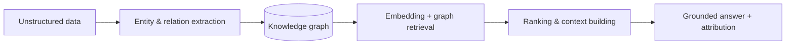

 

🎓 Computer Engineering @ <b>Sharif University</b> &nbsp;·&nbsp; 🏅 Top <b>0.04%</b> — National Entrance Exam &nbsp;·&nbsp; 🔬 Vision-Transformer Interpretability

---

## 🧠 What I build

I build the **retrieval and knowledge layer** that turns messy, unstructured data into structured knowledge people and AI agents can actually use.

## 💼 Experience

| Role | What I worked on |
| --- | --- |
| **Applied Scientist** · food-delivery platform | Graph-based recommenders, Learning-to-Rank ranking pipelines (LambdaMART), CTR prediction, and an **LLM agent** that automates content-policy review |
| **ML Research Intern** · university ML lab | Feature attribution & mechanistic interpretability for **Vision Transformers** (Tuned Lens) — targeting ICLR |
| **Data Scientist** · ad-tech platform | Interest-based targeting & session classification to optimize ad performance |

*Teaching Assistant for **Deep Learning** & **Information Retrieval** @ Sharif University.*

## 🚀 Selected work

| Project | Focus |
| --- | --- |
| [**Retrieval System for Movies**](https://github.com/AHNakbari/retrieval-system-for-movies) | Query processing, retrieval & relevance ranking of documents — IR + deep learning |
| [**Map Matching & Destination Suggestion**](https://github.com/AHNakbari/map-matching-and-destination-sugesst) | Aligning noisy GPS traces to road segments & predicting routes — graph + sequence modeling |
| [**GPT from Scratch**](https://github.com/AHNakbari/Generative-Pre-trained-Transformers-GPT-) | Transformer / GPT built end to end to understand LLM internals |
| [**Diffusion Models**](https://github.com/AHNakbari/Diffusion-Models) | Denoising diffusion generative models, implemented and explored |

## 🛠️ Stack

**Focus** &nbsp;

**Exploring** &nbsp;

## 📊 GitHub

## 🤝 Connect

